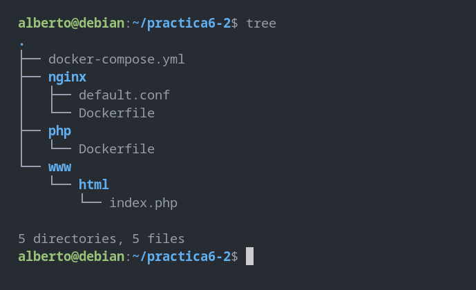
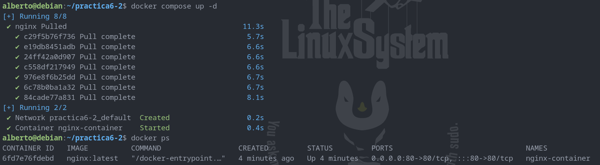
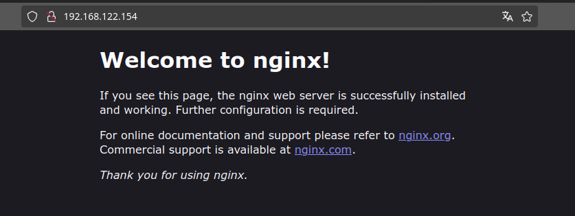
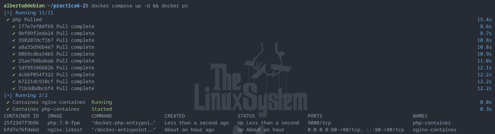
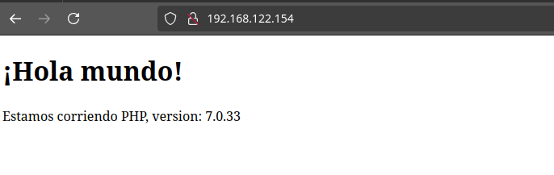
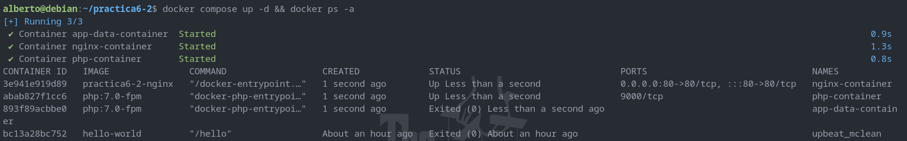
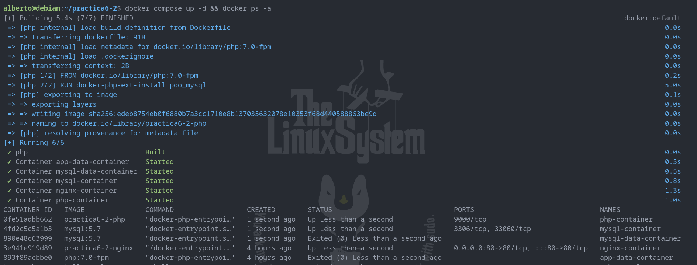
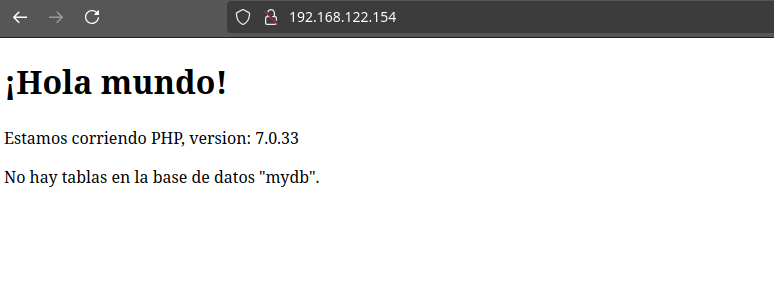
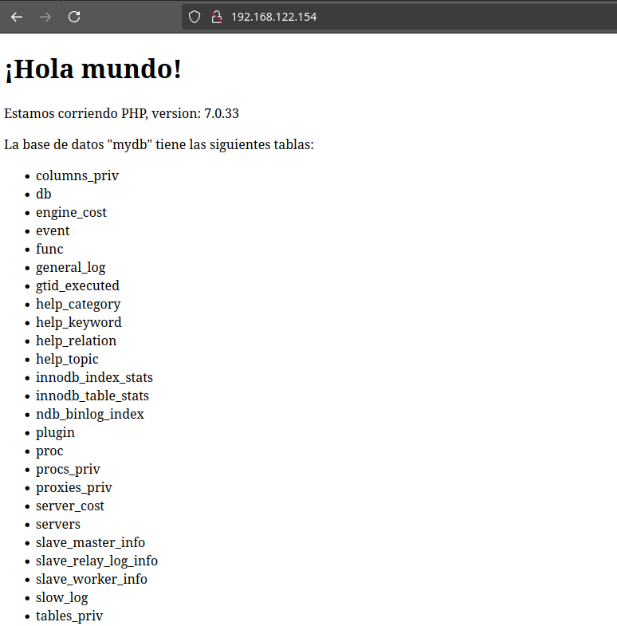

# Despliegue de una aplicación PHP con Nginx y MySQL usando Docker y Docker-compose

Para la realización de esta práctica, se parte de una estructura de directorios y 
archivos tal que: 



## Creación de un contenedor Nginx

En primer lugar, comenzaremos modificando el archivo docker-compose.yml. 
Su contenido será:

```yaml
services:
  nginx:
    image: nginx:latest
    container_name: nginx-container
    ports:
      - 80:80
```

Con este contenido estamos indicando que se debe descargar una imagen de 
la última versión de Nginx, crear un contenedor con ella y que este debe 
escuchar en el puerto 80 (que se corresponde con el 80 de nuestra máquina). 

Para que se lleven a cabo estas acciones, ejecutamos:

```console
docker compose up -d
```

Y para comprobar que el contenedor está corriendo:

```console
docker ps
```

Al ejecutar estos comandos, si no ha habido ningún problema, debemos 
ver la siguiente respuesta:



Y si accedemos al puerto 80 de la IP de la máquina virtual desde el 
navegador de la máquina anfitriona, veremos:



Lo que significa que Nginx ya está funcionando sin problemas.

## Creación de un contenedor PHP

En primer lugar, modificaremos el archivo 'www/html/index.php'. Su 
contenido será:

```php
<!DOCTYPE html>
<head>
  <title>¡Hola mundo!</title>
</head>

<body>
  <h1>¡Hola mundo!</h1>
  <p><?php echo 'Estamos corriendo PHP, version: ' . phpversion(); ?></p>
</body>
```

Ahora, para que Nginx pueda correr nuestra aplicación PHP, modificaremos 
el archivo 'nginx/default.conf'.

El contenido del archivo de configuración será:

```nginx
server {

     listen 80 default_server;
     root /var/www/html;
     index index.html index.php;

     charset utf-8;

     location / {
      try_files $uri $uri/ /index.php?$query_string;
     }

     location = /favicon.ico { access_log off; log_not_found off; }
     location = /robots.txt { access_log off; log_not_found off; }

     access_log off;
     error_log /var/log/nginx/error.log error;

     sendfile off;

     client_max_body_size 100m;

     location ~ .php$ {
      fastcgi_split_path_info ^(.+.php)(/.+)$;
      fastcgi_pass php:9000;
      fastcgi_index index.php;
      include fastcgi_params;
      fastcgi_param SCRIPT_FILENAME $document_root$fastcgi_script_name;
      fastcgi_intercept_errors off;
      fastcgi_buffer_size 16k;
      fastcgi_buffers 4 16k;
    }

     location ~ /.ht {
      deny all;
     }
    }
```

Ahora modificaremos el archivo 'nginx/Dockerfile'. Su contenido será:

```dockerfile
FROM nginx:latest
COPY ./default.conf /etc/nginx/conf.d/default.conf
```

Y por último, volveremos a modificar el archivo 'docker-compose.yml' 
para que se descargue una imagen de PHP y se cree un contenedor a 
partir de ella. El nuevo contenido de este archivo será:

```yaml
services:
  nginx:
    build: ./nginx/
    container_name: nginx-container
    ports:
      - 80:80
    links:
      - php
    volumes:
      - ./www/html/:/var/www/html/

  php:
    image: php:7.0-fpm
    container_name: php-container
    expose:
      - 9000
    volumes:
      - ./www/html/:/var/www/html/
```

Volvemos a ejecutar los comandos:

```console
docker compose up -d
docker ps
```

El resultado es:



Si ahora volvemos a acceder a nuestra máquina virtual a través del 
puerto 80 usando el navegador, podremos observar el contenido de 
la aplicación PHP que hemos creado, servida por Nginx:



Ya tenemos Nginx y PHP funcionando sin problemas.

## Creación de un contenedor para Datos

En el 'docker-compose.yml' está indicado que, tanto para Nginx como para PHP, 
hay que montar el directorio 'www/html'. Una manera más adecuada de hacerlo es 
crear un contenedor independiente para datos que se enlace con los contenedores 
ya existentes de Nginx y PHP. Para ello, volveremos a modificar el archivo 
'docker-compose.yml'. Su nuevo contenido será:

```yaml
services: 
  nginx:
    build: ./nginx/
    container_name: nginx-container
    ports:
      - 80:80
    links:
      - php
    volumes_from:
      - app-data

  php:
    image: php:7.0-fpm
    container_name: php-container
    expose:
      - 9000
    volumes_from:
      - app-data

  app-data:
    image: php:7.0-fpm
    container_name: app-data-container
    volumes:
      - ./www/html/:/var/www/html/
    command: "true"
```

Volvemos a ejecutar:

```console
docker compose up -d
docker ps -a
```

El resultado debe ser:



## Creación de un contenedor MySQL

Por último, crearemos un contenedor con MySQL como BBDD para la aplicación. 
En primer lugar, nos aseguraremos de que PHP podrá comunicarse con MySQL 
editando el archivo 'php/Dockerfile' e indicaremos que se instale la 
extensión de PDO (que sirve en PHP para crear conexiones a BBDD y realizar 
consultas). El contenido del archivo será:

```dockerfile
FROM php:7.0-fpm
RUN docker-php-ext-install pdo_mysql
```

Tendremos que editar el archivo 'docker-compose.yml' por última vez para 
que se generen contenedores que gestionen la BBDD MySQL así como para 
relacionarlos con los contenedores que ya hemos creado (PHP, Nginx, app-data). 
El contenido final de 'docker-compose.yml' será:

```yaml
services:
  nginx:
    build: ./nginx/
    container_name: nginx-container
    ports:
      - 80:80
    links:
      - php
    volumes_from:
      - app-data
  php:
    build: ./php/
    container_name: php-container
    expose:
      - 9000
    links:
      - mysql
    volumes_from:
      - app-data

  app-data:
    image: php:7.0-fpm
    container_name: app-data-container
    volumes:
      - ./www/html/:/var/www/html/
    command: "true"

  mysql:
    image: mysql:5.7
    container_name: mysql-container
    volumes_from:
      - mysql-data
    environment:
      MYSQL_ROOT_PASSWORD: secret
      MYSQL_DATABASE: mydb
      MYSQL_USER: myuser
      MYSQL_PASSWORD: password

  mysql-data:
    image: mysql:5.7
    container_name: mysql-data-container
    volumes:
      - /var/lib/mysql
    command: "true"
```

También modificaremos el archivo 'www/html/index.php' para que en él se 
implementen conexión y consultas a la BBDD a través de PDO. El contenido 
será:

```php
     <!DOCTYPE html>
     <head>
      <title>¡Hola mundo!</title>
     </head>

     <body>
      <h1>¡Hola mundo!</h1>
      <p><?php echo 'Estamos corriendo PHP, version: ' . phpversion(); ?></p>
      <?
       $database ="mydb";
       $user = "myuser";
       $password = "password";
       $host = "mysql";

       $connection = new PDO("mysql:host={$host};dbname={$database};charset=utf8", $user, $password);
       $query = $connection->query("SELECT TABLE_NAME FROM information_schema.TABLES WHERE TABLE_TYPE='BASE TABLE'");
       $tables = $query->fetchAll(PDO::FETCH_COLUMN);

        if (empty($tables)) {
          echo "<p>No hay tablas en la base de datos \"{$database}\".</p>";
        } else {
          echo "<p>La base de datos \"{$database}\" tiene las siguientes tablas:</p>";
          echo "<ul>";
            foreach ($tables as $table) {
              echo "<li>{$table}</li>";
            }
          echo "</ul>";
        }
        ?>
    </body>
</html>
```

Levantamos los contenedores de la aplicación ejecutando de nuevo:

```console
docker compose up -d
docker ps -a
```

Que debe devolver una respuesta como esta:



Y si volvemos a acceder desde nuestro navegador a la aplicación:



Que nos responda que "No hay tablas en la base de datos..." no es un error; 
ahora sólo estamos comprobando que los contenedores se han creado y que están 
enlazados correctamente. Para que se acceda a la BBDD y se muestren 
correctamente las tablas de la BBDD será necesario hacer una pequeña 
modificación.

## Verificación de la conexión a la BBDD

El motivo por el que las tablas no están visibles en la aplicación es que 
la conexión que estamos realizando desde 'www/html/index.php' utiliza los 
datos de un usuario sin privilegios para acceder a las tablas de la BBDD. 
Para acceder con un usuario con permisos y que podamos comprobar que la 
conexión a la BBDD funciona y devuelve datos correctos, es necesario, en 
'www/html/index.php', cambiar los valores de dos variables:

```php
$user = "root";
$password = "secret";
```

Con este pequeño cambio, si accedemos de nuevo a la aplicación desde el 
navegador, podremos ver los datos almacenados en la BBDD (en este caso, 
estamos consultando los nombres de las tablas existentes):


